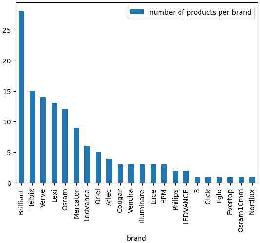
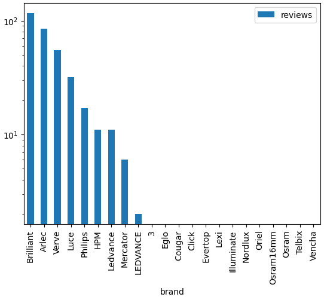

## Using DeepSeek to crawl Bunnings website

In this repository, the DeepSeek LLM was used to collect information about ceiling lights from the Bunnings website and create a catalog from it. For every item found in the website, the price, title, and number of reviews were collected. 

This repository is based on the work done by Brandon in this [link](https://www.youtube.com/watch?v=Osl4NgAXvRk). 


## Project Structure
```
.
├── assets
│   ├── quantity.py
│   └── reviews.py 
├── utils
│   ├── init.py 
│   ├── data_classes.py
│   ├── data_utils.py
│   └── scraper_utils.py 
├── config.py 
├── main.ipynb 
├── pyproject.toml 
├── .gitignore 
└── README.md
```

## Installtion
1. Install uv (uv is a fast python package manger):
```bash
pip install uv
```

2. Create a virtul environment in '.venv' folder:

```bash
uv run install
```

3. Activate the virtual environment:
```bash
source .venv/bin/activate
```

4. Run the following command to be able to run the jupyter notebook in vscode: 

```bash
python -m pip install ipykernel -U --force-reinstall
```

5. Create an API key from [Groq](https://console.groq.com/keys) and set it up as an environment variable:
```bash
export GROQ_API_KEY="your_actual_api_key_here"
```
You could also create .env folder and place you API key there. 

6. Run the notebook file ```main.ipynb```.

If you want to change the website you need to read, then change the content of the ```config.py``` file accordingly. 


## Sample outputs after running the jupyter file

<table>
  <tr>
    <td>
      <p>Quantity </p>
      
    </td>
    <td>
      <p>Number of reviews</p>
      
    </td>
  </tr>
</table>


